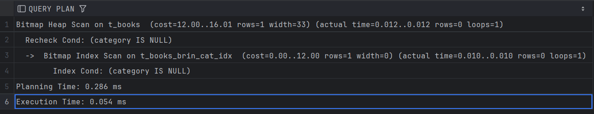
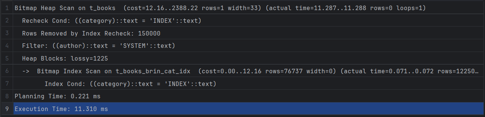
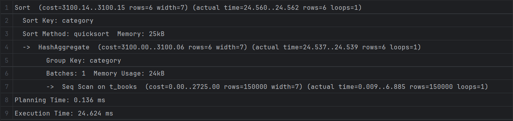
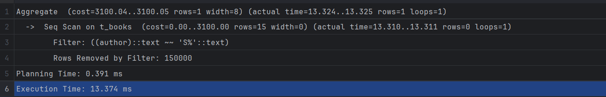
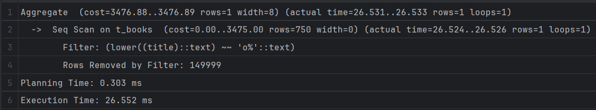
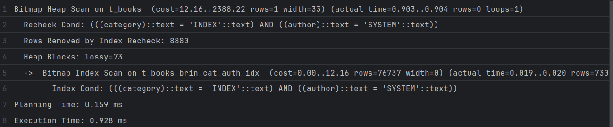

# Задание 1: BRIN индексы и bitmap-сканирование

1. Удалите старую базу данных, если есть:

   ```shell
   docker compose down
   ```

2. Поднимите базу данных из src/docker-compose.yml:

   ```shell
   docker compose down && docker compose up -d
   ```

3. Обновите статистику:

   ```sql
   ANALYZE t_books;
   ```

4. Создайте BRIN индекс по колонке category:

   ```sql
   CREATE INDEX t_books_brin_cat_idx ON t_books USING brin(category);
   ```

5. Найдите книги с NULL значением category:

   ```sql
   EXPLAIN ANALYZE
   SELECT * FROM t_books WHERE category IS NULL;
   ```

   *План выполнения:*


   *Объясните результат:*
   Индекс сработал даже на nullable категории.

6. Создайте BRIN индекс по автору:

   ```sql
   CREATE INDEX t_books_brin_author_idx ON t_books USING brin(author);
   ```

7. Выполните поиск по категории и автору:

   ```sql
   EXPLAIN ANALYZE
   SELECT * FROM t_books 
   WHERE category = 'INDEX' AND author = 'SYSTEM';
   ```

   *План выполнения:*
   

   *Объясните результат (обратите внимание на bitmap scan):*
   Сработал индекс только на категорию книги, логично, так как у нас нет  составного индекса для категории и автора.

8. Получите список уникальных категорий:

   ```sql
   EXPLAIN ANALYZE
   SELECT DISTINCT category 
   FROM t_books 
   ORDER BY category;
   ```

   *План выполнения:*
   

   *Объясните результат:*
   Сначала шли последоавтельно по таблицу, потом агрегировали данные с помощью HashAggregate и отсортировали строки в конце.

9. Подсчитайте книги, где автор начинается на 'S':

   ```sql
   EXPLAIN ANALYZE
   SELECT COUNT(*) 
   FROM t_books 
   WHERE author LIKE 'S%';
   ```

   *План выполнения:*
   

   *Объясните результат:*
   Здесь просто сначала последовательно шли по таблице и фильтровали строки, после чего агрегировали данные, в этом случае посчитали кол-во строк.

10. Создайте индекс для регистронезависимого поиска:

    ```sql
    CREATE INDEX t_books_lower_title_idx ON t_books(LOWER(title));
    ```

11. Подсчитайте книги, начинающиеся на 'O':

    ```sql
    EXPLAIN ANALYZE
    SELECT COUNT(*) 
    FROM t_books 
    WHERE LOWER(title) LIKE 'o%';
    ```

   *План выполнения:*
   

   *Объясните результат:*
   Для LIKE такие индексы не работают, нужно использовать специальный GIN индекс, чтобы ускорить поиск.

12. Удалите созданные индексы:

    ```sql
    DROP INDEX t_books_brin_cat_idx;
    DROP INDEX t_books_brin_author_idx;
    DROP INDEX t_books_lower_title_idx;
    ```

13. Создайте составной BRIN индекс:

    ```sql
    CREATE INDEX t_books_brin_cat_auth_idx ON t_books 
    USING brin(category, author);
    ```

14. Повторите запрос из шага 7:

    ```sql
    EXPLAIN ANALYZE
    SELECT * FROM t_books 
    WHERE category = 'INDEX' AND author = 'SYSTEM';
    ```

   *План выполнения:*
   

   *Объясните результат:*
   Теперь индекс сработал, т. к. он составной, но большого выигрыша по стоимости мы не получили, а время исполнения даже стало больше. Это связано с тем, что BRIN предназначен для обработки больших таблиц, в которых значение индексируемого столбца имеет естественную корреляцию с физическим положением строки в таблице.
