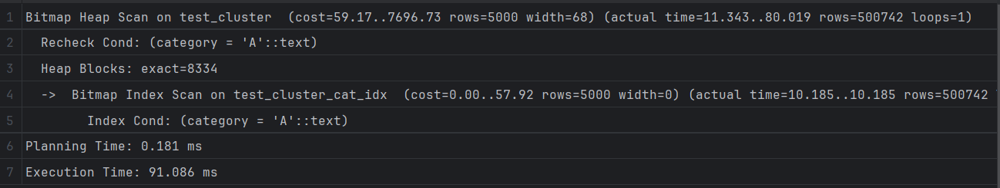
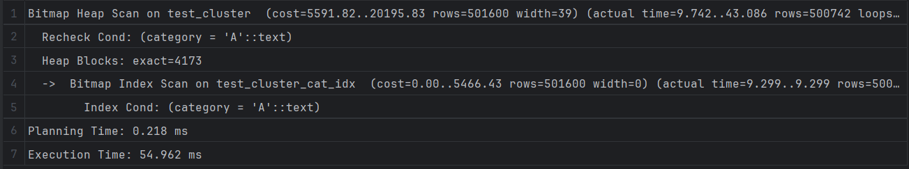

## Задание 3

1. Создайте таблицу с большим количеством данных:

    ```sql
    CREATE TABLE test_cluster AS 
    SELECT 
        generate_series(1,1000000) as id,
        CASE WHEN random() < 0.5 THEN 'A' ELSE 'B' END as category,
        md5(random()::text) as data;
    ```

2. Создайте индекс:

    ```sql
    CREATE INDEX test_cluster_cat_idx ON test_cluster(category);
    ```

3. Измерьте производительность до кластеризации:

    ```sql
    EXPLAIN ANALYZE
    SELECT * FROM test_cluster WHERE category = 'A';
    ```

    *План выполнения:*
    

    *Объясните результат:*
    Довольно долго и дорого, хотя и использовался индекс для категорий.

4. Выполните кластеризацию:

    ```sql
    CLUSTER test_cluster USING test_cluster_cat_idx;
    ```

    *Результат:*
    [Вставьте результат выполнения]

5. Измерьте производительность после кластеризации:

    ```sql
    EXPLAIN ANALYZE
    SELECT * FROM test_cluster WHERE category = 'A';
    ```

    *План выполнения:*
    

    *Объясните результат:*
    Cost вырос, но и производительность улучшилась.

6. Сравните производительность до и после кластеризации:

    *Сравнение:*
    Т. к. у нас всего две категории или A или B, то кластеризация помогла упорядочить эти данные, и поиск по этому свойству заметно быстрее, но также возросли и накладные расходы, т. к. кластеризированная таблица хранит много метаданных.
